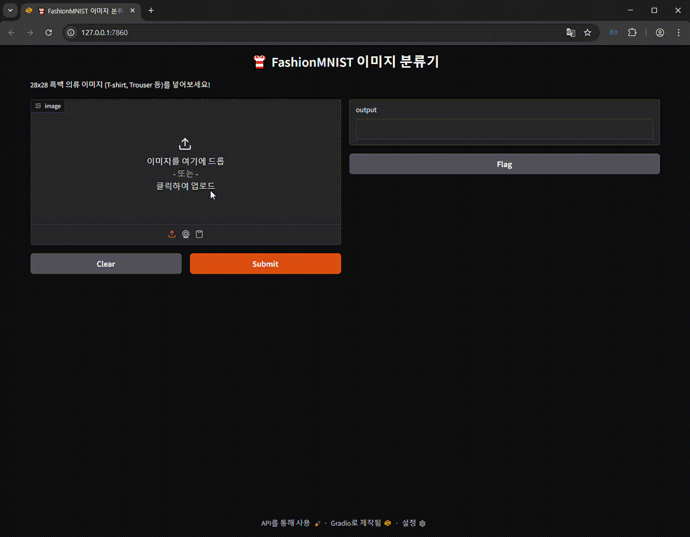

# 🧠 FashionMNIST 이미지 분류기

28×28 흑백 의류 이미지를 분류하는 딥러닝 모델입니다.  
PyTorch로 학습된 모델을 FastAPI와 Gradio를 통해 실시간 분류할 수 있도록 구성했습니다.

---

## 📁 프로젝트 구조

```python
CNN/
├── api/ # FastAPI 서버 (fashion_server.py)
├── data/FashionMNIST/ # IDX 데이터 (자동 다운로드됨)
├── demo/ # 데모 영상 (gif)
│ └── demo.gif
├── frontend/ # Gradio 클라이언트
│ └── fashion_client.py
├── models/ # 모델 정의 및 학습 코드
│ └── fashion_classifier.py
├── saved_models/ # 학습된 모델
│ ├── model_weights.pth
│ └── model.pt
├── test_samples/ # 테스트 이미지 (직접 확인용)
├── README.md
```

---

## 📺 데모 영상

> 아래 이미지를 클릭하거나 `demo/demo.gif` 참조



---

## 🚀 사용 방법

### 1. FastAPI 서버 실행

```bash
uvicorn api.fashion_server:app --reload
```

### 2. Gradio 프론트 실행

```bash
python frontend/fashion_client.py
```

`test_samples/` 폴더의 PNG 이미지를 드래그하면 예측 결과를 확인할 수 있습니다.

---

# 🛠 기술 스택

- Python 3.10+
- PyTorch
- Torchvision
- FastAPI
- Gradio
- scikit-learn (리포트 및 평가용)

---

# 🧪 모델 학습 방법

```bash
python models/fashion_classifier.py
```

학습이 완료되면 `saved_models/` 폴더에 다음 파일이 생성됩니다:

`model_weights.pth`: 가중치만 저장
`model.pt`: 전체 모델 저장
